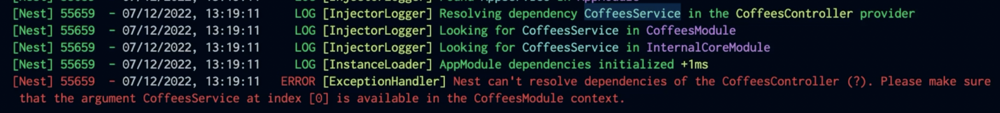

### debug
运行下面的命令得到依赖解析相关信息
```shell
NEST_DEBUG=TRUE pnpm start:dev
```



madge 进行依赖循环检测，提供可视化方式
```shell
npx madge dist/main.js --circular // 文字方式 
npx madge dist/main.js --image graph.png // 图片方式
```

### 依赖注入应该使用 Inject()显示注入，而不是通过类去隐式注入


### lazyload module
LazyModuleLoader异步加载模块，用于微服务，定时任务，无服务函数等功能

### 周期监听 scheduler
通过监听nestjs的生命周期OnApplicationBootstrap, OnApplicationShutdown，可以获得所有注入的modules，service等模块。通过找到特定的装饰器来在生命周期是执行特定的结果


### worker线程
> src/fibonacci
耗时很长，或者异步任务可以使用worker进行异步处理，不会阻塞掉其他请求访问程序

> src/fibonacci/fibonacci-worker.host.ts
fibonacci的worker模块，在生命周期时进行初始化和释放，并且实现执行方案，注入到module中。
通过piscina管理worker线程池